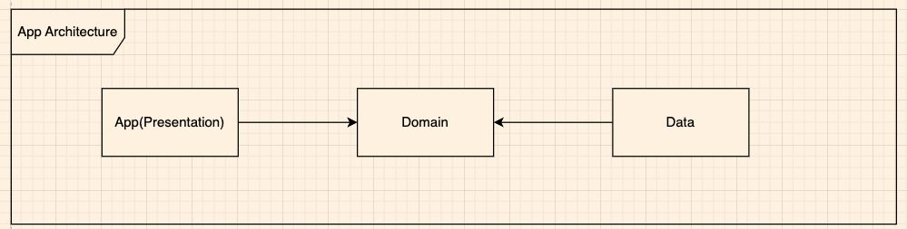
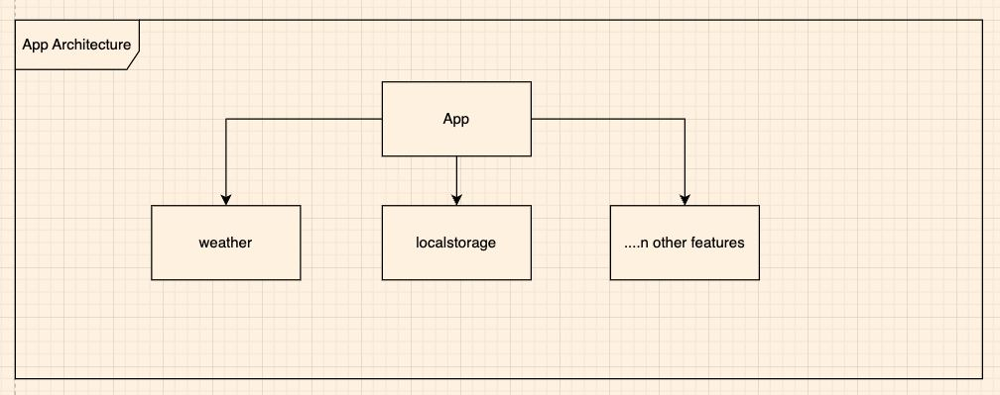
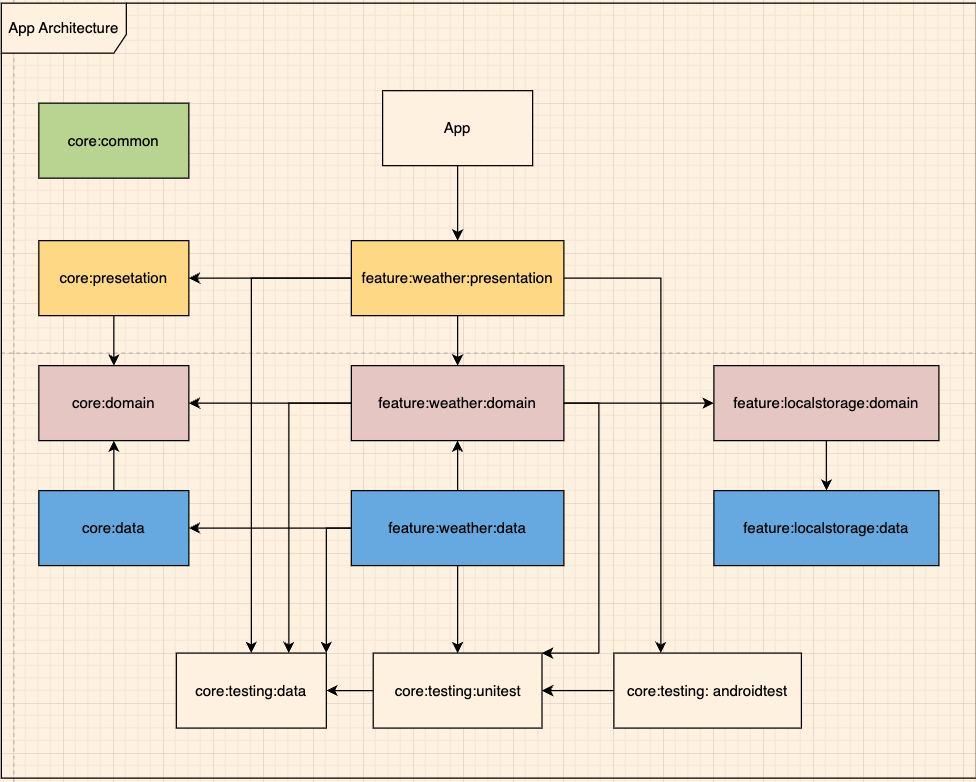
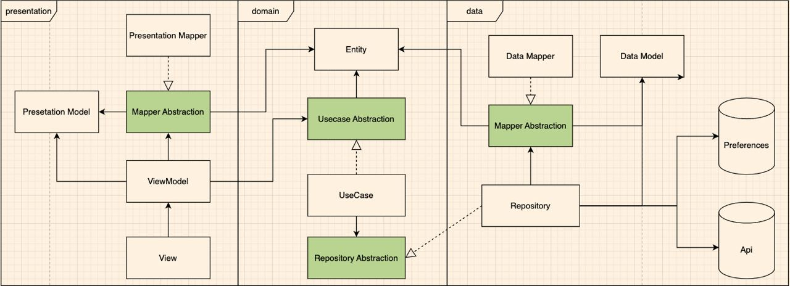

## Features
- View weather information by location
- Search for locations
- Save favorite places
- Retry api when network error

## App Architecture

Clean architecture is a software design principle that advocates for the separation of concerns and logical distribution of code to facilitate the application’s evolution, testing, and maintenance.

Normally with this architecture we will have 3 separate layers:
- Domain layer: This is the central layer, also known as the heart of this architecture. It is where all the business logic of the application is stored and managed. It will exist independently and not depend on other layesr. This will be a layer that is pure kotlin/java code.
- Presentation layer: This layer is responsible for handling tasks in terms of displaying user interfaces as well as receiving their interactions.  This will be a class directly related to the Android framework. This layer can interact with the domain layer to retrieve data or transmit actions corresponding to user interaction.
- Data layer: This will similarly be a layer of the Android framework. We will handle all input/output of the actual data application here. You can call the api to get data from the network, call RoomDatabase to get data from the local database,...

### Pros
Because of its separate nature, it is not surprising that this architecture has many advantages:
- Testability
- Ease of Maintenance
- Separation of Concerns

### Cons
- This model is sometimes a bit complicated for small-scale projects.
- The number of classes will certainly be significantly more than other types of architectures.
- Although having 3 layers as described above has many effects, if the project grows larger we will encounter the following problem:

As the number of features increases in the project, we will write the code of all those features into layers like this. As time goes on, the code in these layers will increase, and you will no longer be able to control their individuality. It is very easy to write dependent code. At the same time, when a feature is changed, you wouldn't want the whole module to have to be rebuilt?

### Solution for this application
To solve the above problem for this application, we will talk more about one type of dividing folders: division by feature.

With this type of division, we will have the advantage that our codes will have high cohension. Codes in the same module are closely related to each other, ensuring independence from other features.

However, if there is no layer division, in each module of the feature, the codes will not be clearly separated in terms of their responsibilities: what is the UI code, what is the business code, or what is the API call processing code? ,...

> So the final solution for this application: is the combination of division by both features and layers

## Plugins & libraries
# 1. Android Architect Component
- Lifecycle-aware

Lifecycle-aware components perform actions in response to a change in the lifecycle status of another component, such as activities and fragments. These components help you produce better-organized, and often lighter-weight code, that is easier to maintain.

The androidx.lifecycle package provides classes and interfaces that let you build lifecycle-aware components—which are components that can automatically adjust their behavior based on the current lifecycle state of an activity or fragment.

> In fact, we will use it as a way to combine with kotlin coroutine to automate the handling of this lifecycle.

- Android ViewModel

This is an extremely useful component that makes up the power of MVVM/Clean architecture.

From android.developer's description:
> The ViewModel class is a business logic or screen level state holder. It exposes state to the UI and encapsulates related business logic. Its principal advantage is that it caches state and persists it through configuration changes. This means that your UI doesn’t have to fetch data again when navigating between activities, or following configuration changes, such as when rotating the screen.

# 2. Asynchronous programming - Coroutine
We will use kotlin coroutine for this purpose.
We have had a lot of arguments about whether to use coroutine or RxJava/RxAndroid. But after experiencing both types, we can have the following conclusion:

- First of all, nowadays when Kotlin's popularity has increased a lot, as well as official support and suggestions from Google, using coroutine will help us get some support for a long time.
- Coroutine is very lightweight compared to Thread. Even we can have thousands of coroutines without affecting performance. That is also the reason why it is called a "lightweight thread".
- Both asynchronous and parallel calls are supported.
- Writing suspend makes the code more natural and easier to read than writing with callbacks like RX.

# 3. Dependencies Injection - Koin
In fact, in projects, I prefer using Hilt. However, in this demo I will use koin. Regarding the cause, we will go through the advantages and disadvantages of koin - dagger/hilt (briefly).

| Syntax      | Koin | Dagger/Hilt |
| ----------- | ----------- | ----------- |
| Build-Time Or Run-Time      |  Koin will be run at run-time. It will not generate any code first. Therefore its compile time is very fast. However, run-time performance will be slower.      | Dagger/Hilt will generate code at compile-time first. Therefore, it may take a long time to compile, but the performance when running the app is better.|
| Error handling   | Because it is not checked at compile time, it is entirely possible that there will be a crash or error when running the app   | Syntax is checked at compile time so error coverage is better|
| Level of difficult   |    Easy to use     |It will be more complicated if using dagger. But since hilt was introduced, using hilt has become much simpler |

>From some of the points above, hilt is rated very highly. However, as mentioned, depending on each situation, we will choose the appropriate model.

>With this demo project, the amount that needs to be injected is quite small. Choosing koin will help achieve fast integration speed. As for performance, it is not affected too much because it is only a small project
# 4. Image loader - Glide
Glide as well as Picasso are quite popular image loading libraries in Android. Here we will use Glide for the following reasons:

1. Fast speed: Glide supports smart caching mechanism at many levels: Network - Disk - RAM
2. Automatically convert image size to match the size of ImageView
3. Supports many utilities such as transform, place holder, thumbnail, etc.

# 5. Network library - Retrofit
In short, Retrofit is a technology developed by Square, it is built on many powerful technologies that allow it to handle requests from the client and server side in the fastest and most effective way. In short, Retrofit is a REST Client for Android and Java. Retrofit was developed to make the client-server connection process easy and fast.

# 6. Testing framework
1. [Mockk](https://mockk.io) MockK is a testing library that supports Kotlin language features and constructs by building proxies for mocked classes.
2. [MockWebServer](https://github.com/square/okhttp/tree/master/mockwebserver) This library makes it easy to test that your app Does The Right Thing when it makes HTTP and HTTPS calls. It lets you specify which responses to return and then verify that requests were made as expected.
3. [Kaspresso](https://github.com/KasperskyLab/Kaspresso) Kaspresso is a framework for Android UI testing. Based on Espresso and UI Automator.
4. [Turbine](https://github.com/cashapp/turbine) Turbine is a small testing library for kotlinx.coroutines Flow.
# 7. Gradle build
In this project use Composite build for Gradle. 
[CompositeBuild](https://docs.gradle.org/current/userguide/composite_builds.html)
## How to run this project
Open the gradle.properties file and update the WEATHER_API_KEY variable to your actual value.

Key: 945ccd5ebce87996931812875131ea22